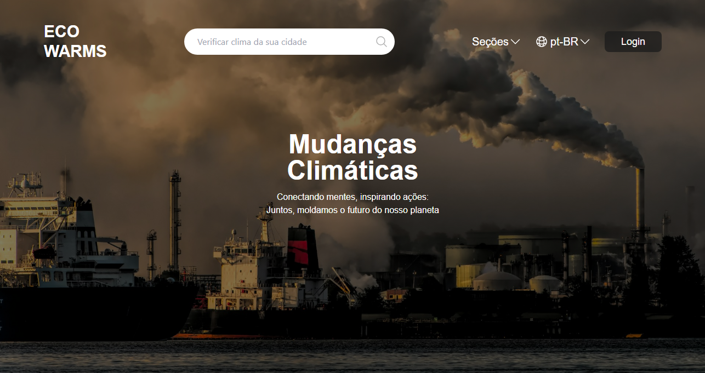

[PROJECT__BADGE]: https://img.shields.io/badge/📱Visit_this_project-000?style=for-the-badge&logo=project
[PROJECT__URL]: https://eco-warms.vercel.app

  

# EcoWarms

Site feito para um projeto da faculdade e aproveitando para começar a praticar um pouco sobre o Tailwind

[![project][PROJECT__BADGE]][PROJECT__URL]

## Tech Stack

## Contribute

1. **Clone project**: `git clone https://github.com/RodriguesGS/EcoWarms.git`
2. **Create feature/branch**: `git checkout -b feature/NAME`